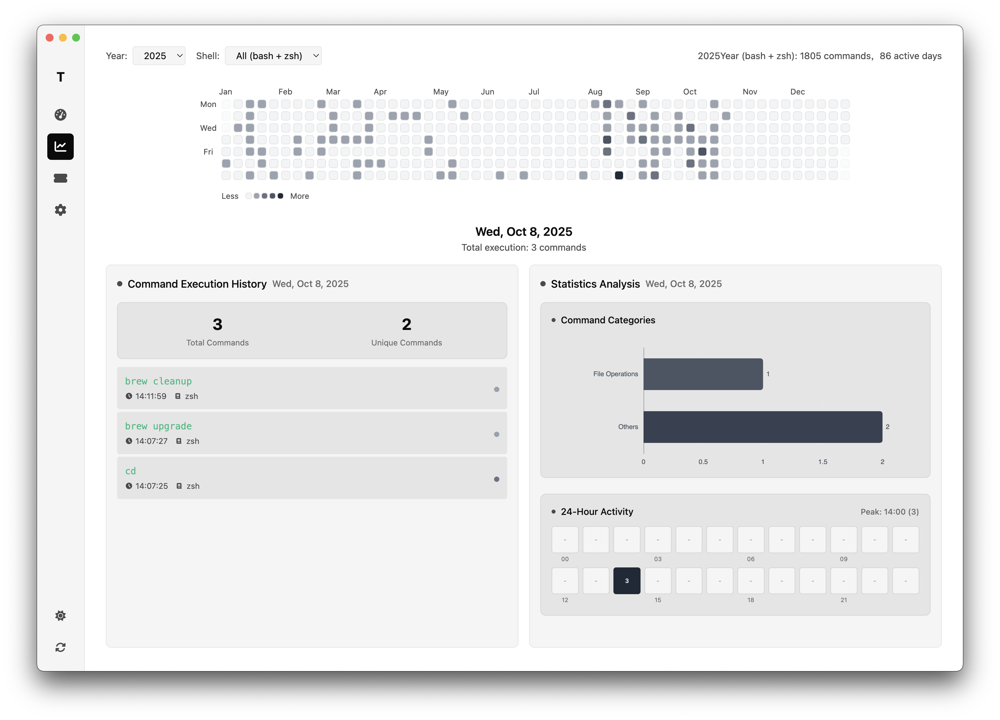

# Termlytic Preview

[](https://opensource.org/licenses/MIT) [](https://www.electronjs.org/) [](https://vuejs.org/) [](https://nodejs.org/)

🚀 **A powerful and beautiful terminal command analytics application** that transforms your shell history into meaningful insights and stunning visualizations.

Termlytic analyzes your command-line usage patterns and provides comprehensive analytics through an elegant, modern interface. Whether you're a developer wanting to optimize your workflow or just curious about your terminal habits, Termlytic gives you the data-driven insights you need.


---

**🇺🇸 English** | **[🇨🇳 中文](README_CN.md)**

---

> ⚠️ **Beta Preview Warning**  
> This project is currently in **beta/preview** version. Most of the codebase was generated with AI assistance and may contain bugs or incomplete features. Use at your own discretion and feel free to report issues!

## 💡 Why I Made This

I've always been passionate about data visualization and turning raw information into beautiful, meaningful insights. This project was inspired by [cmd-wrapped](https://github.com/YiNNx/cmd-wrapped), a fantastic Rust-based tool that analyzes terminal usage.

I wanted to create something similar but with:
- **Real-time analytics** instead of just yearly summaries
- **Interactive visualizations** that you can explore and drill down into
- **Cross-platform desktop app** with a modern, responsive interface
- **Multi-shell support** with intelligent parsing and caching

The goal was to build a tool that not only shows you *what* commands you use, but *when*, *how often*, and *in what patterns* - helping developers understand and optimize their workflow habits.

## ✨ Features

- **📊 Comprehensive Analytics**: Analyze your shell command history with detailed statistics including:
  - Daily, weekly, monthly, and yearly command counts
  - Most frequently used commands and execution patterns
  - Shell type distribution (Zsh, Bash, Fish)
  - Command execution time trends

- **🎯 Command Insights**: Discover your productivity patterns:
  - Top commands by frequency and recency
  - Command categorization (File Operations, Development Tools, System Management)
  - Hourly activity distribution to identify peak productivity times
  - Command complexity analysis

- **📈 Visual Dashboard**: Beautiful interactive charts powered by ECharts:
  - Real-time statistics with responsive design
  - Weekly and monthly activity visualizations
  - Command distribution pie charts
  - Timeline-based activity tracking

- **⏰ Time-based Analysis**: Interactive heatmap calendar view:
  - GitHub-style contribution heatmap for daily command usage
  - Click any day to see detailed command history
  - Multi-year view with shell type filtering
  - Daily command breakdown with time stamps

- **🔍 Multi-shell Support**: Seamless integration with popular shells:
  - Zsh with extended history format
  - Bash with timestamp formatting
  - Fish with native timestamp support
  - Automatic shell detection and parsing

- **⚡ Real-time Updates**: Smart caching and incremental analysis:
  - Monitors shell history files for changes
  - Incremental parsing for large history files
  - Efficient data caching for fast load times
  - Background analysis without UI blocking

- **🎨 Modern UI**: Clean, responsive interface:
  - Dark theme optimized for developers
  - Responsive design for different screen sizes
  - Smooth animations and transitions
  - Keyboard shortcuts for quick navigation

## 📸 Screenshots

### Dashboard Overview

*The main dashboard provides an overview of your terminal usage with key statistics, recent commands, and activity trends. View your most used commands, daily/weekly/monthly statistics, and shell distribution at a glance.*

### Heatmap Analytics  

*Interactive heatmap visualization shows your command usage patterns over time. Click on any day to see detailed command history and statistics for that specific date. Supports multiple years and shell type filtering.*

### Ticket Board View

*A unique ticket-style interface that presents your command data in an organized, card-based layout. Perfect for reviewing command patterns and getting insights into your development workflow.*

### GIF Preview


## ⚠️ Important Requirements

**Before using Termlytic, you must configure your shell to save command history with timestamps:**

### For Zsh Users (Required)

Add these lines to your `~/.zshrc` file:

```bash
# Enable extended history format with timestamps
export HISTFILE=~/.zsh_history
export HISTSIZE=10000
export SAVEHIST=10000
setopt EXTENDED_HISTORY
setopt SHARE_HISTORY
setopt HIST_VERIFY
setopt INC_APPEND_HISTORY
```

After adding these lines, restart your terminal or run:
```bash
source ~/.zshrc
```

### For Bash Users

Add these lines to your `~/.bashrc` or `~/.bash_profile`:

```bash
# Enable history with timestamps
export HISTFILE=~/.bash_history
export HISTSIZE=10000
export HISTFILESIZE=20000
export HISTTIMEFORMAT="%Y-%m-%d %H:%M:%S "
export HISTCONTROL=ignoredups:erasedups
```

### For Fish Users

Fish automatically saves timestamps, but you can increase the history size:

```bash
# Add to ~/.config/fish/config.fish
set -g fish_history_max_size 10000
```

**Note**: Without proper shell configuration with timestamps and sufficient history size, Termlytic will not be able to provide accurate analytics.


## 🚀 Quick Start

### Prerequisites

- Node.js (v16 or higher)
- npm or yarn

### Installation

```bash
# Clone the repository
git clone https://github.com/yourusername/ViscmdTE.git
cd ViscmdTE

# Install dependencies
npm install
```

### Development

```bash
# Start development server
npm run dev
```

### Build

```bash
# Build for your current platform
npm run build

# Platform-specific builds
npm run build:win    # Windows
npm run build:mac    # macOS
npm run build:linux  # Linux
```

## 🏗️ Project Structure

```
src/
├── main/                    # Electron main process
│   ├── modules/            # Core modules
│   ├── services/           # Business services
│   └── parsers/           # Shell format parsers
├── renderer/               # Vue.js frontend
│   └── src/
│       ├── components/     # Vue components
│       ├── composables/    # Vue composables
│       └── services/       # Frontend services
└── preload/               # Electron preload scripts
```

## 🛠️ Technology Stack

- **Frontend**: Vue 3, Tailwind CSS, ECharts
- **Backend**: Electron, Node.js
- **Build Tool**: Vite, Electron Builder
- **Code Quality**: ESLint, Prettier

## 🔧 Supported Shells

- **Zsh** (.zsh_history) - **Requires EXTENDED_HISTORY configuration**
- **Bash** (.bash_history) - **Requires HISTTIMEFORMAT configuration** 
- **Fish** (fish_history) - **Timestamps enabled by default**

**Note**: Only properly configured shells with timestamp support will work with Termlytic.

## 📝 Usage

### Initial Setup
1. **Configure your shell** (see requirements above) - This is mandatory!
2. Use your terminal normally for a few days to build up history
3. Launch Termlytic

### Using the Application

**Dashboard Page:**
- View your overall terminal usage statistics
- See your most frequently used commands
- Check daily, weekly, and monthly activity trends
- Monitor shell distribution across different environments

**Heatmap Page:**
- Explore your command usage in a GitHub-style calendar view
- Click on any date to see detailed command history for that day
- Filter by different shell types (Zsh, Bash, Fish)
- Switch between different years to see historical patterns

**Ticket Board Page:**
- Browse your command data in an organized card layout
- Get insights into your development workflow patterns
- Review command categories and usage frequencies

**Settings Page:**
- Configure application preferences
- Run diagnostic tools to troubleshoot issues
- View system information and shell detection status

### Troubleshooting
If you see "No data" or empty charts:
1. Verify your shell configuration includes timestamps
2. Check that `HISTSIZE` and `SAVEHIST` are set to at least 1000
3. Ensure you have recent command history (use terminal for a while)
4. Use the diagnostic tools in the Settings page

## 🐛 Troubleshooting

**Common Issues:**

1. **No data displayed**: 
   - Check shell configuration (timestamps must be enabled)
   - Verify history file exists and has content
   - Ensure history size limits are adequate

2. **Incomplete analytics**:
   - Increase `HISTSIZE` and `SAVEHIST` values
   - Make sure `EXTENDED_HISTORY` is enabled for Zsh

3. **Application won't start**:
   - Check Node.js version (requires v16+)
   - Verify all dependencies are installed

## 🤝 Contributing

Contributions are welcome! Please feel free to submit a Pull Request.

## 📄 License

This project is licensed under the MIT License.
